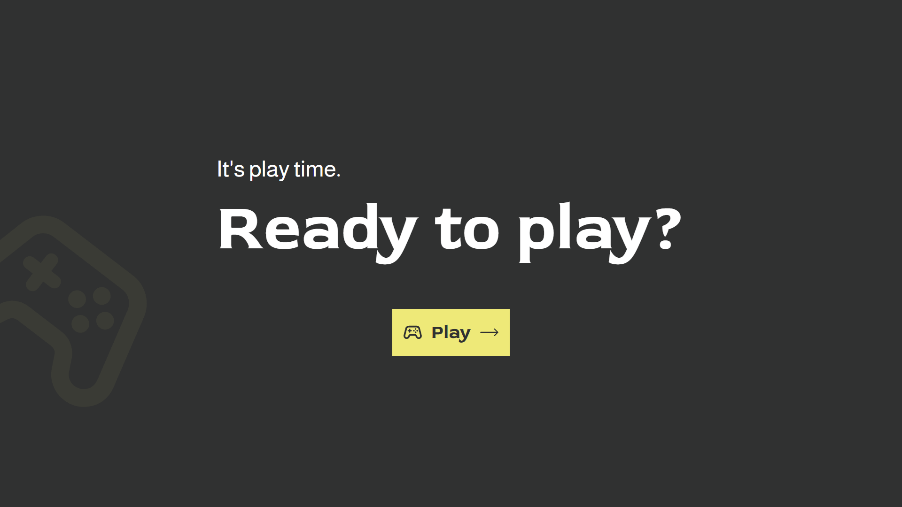
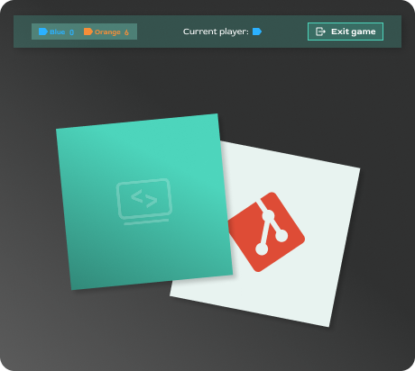
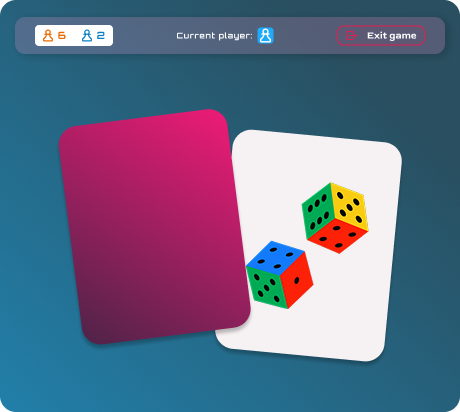
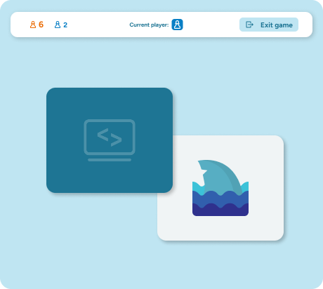
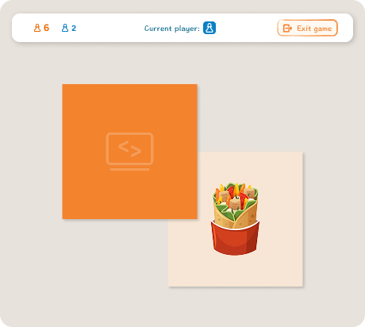

# Memory

A classic memory card-matching game, built as a learning project for TypeScript and Sass.



## Features

- 2-player local mode (blue vs. orange) with live score tracking
- 3 board sizes: 16, 24 or 36 cards
- 4 selectable themes, each with its own colors, fonts and card artwork

<p>
  
  
  
  
</p>

## Tech Stack

- [TypeScript](https://www.typescriptlang.org/)
- [Sass](https://sass-lang.com/)
- [Vite](https://vitejs.dev/)

## Project Structure

- `src/styles/` — SCSS, organized after the 7-1 pattern (`abstract/` for variables, mixins, functions and maps; `base/`, `components/`, `pages/`, `themes/`), each folder forwarded through its own `_index.scss`
- `src/ts/` — TypeScript, split by responsibility: `game.ts` (the `Game` class holding the round's rules), `state.ts`, `dom.ts`, `events.ts`, and one module per screen under `screens/`
- `index.html` — one page, `<template>` elements per screen, swapped into `<main>` at runtime

## Getting Started

```bash
npm install
npm run dev
```

## Scripts

| Command           | Description                        |
| ------------------ | ----------------------------------- |
| `npm run dev`      | Start the dev server                |
| `npm run build`    | Type-check and build for production |
| `npm run preview`  | Preview the production build        |
